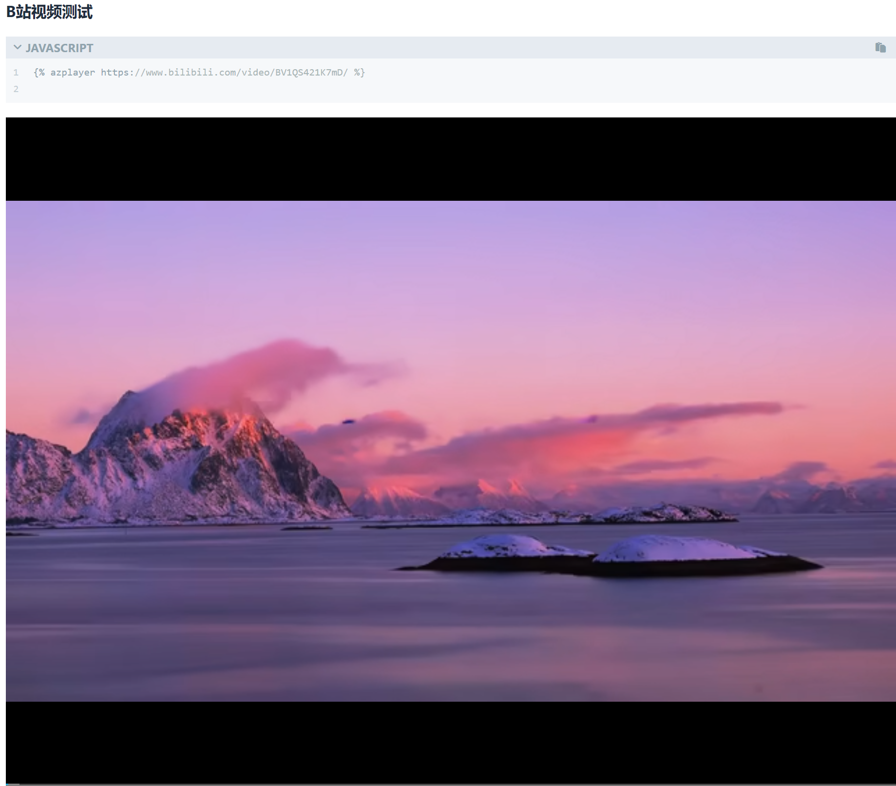

# hexo-tag-azplayer

## 安装
进入 hexo 主目录，然后执行
```
npm i -save  "https://github.com/pxysea/hexo-tag-azplayer.git"
```

## 使用示例

```javascript

```



[查看演示](https://az-web.site/)

## 功能列表

1. 支持 Markdown B站链接

## 感谢

修改自 [hexo-bilibili-plus](https://github.com/pk5ls20/hexo-bilibili-plus)
