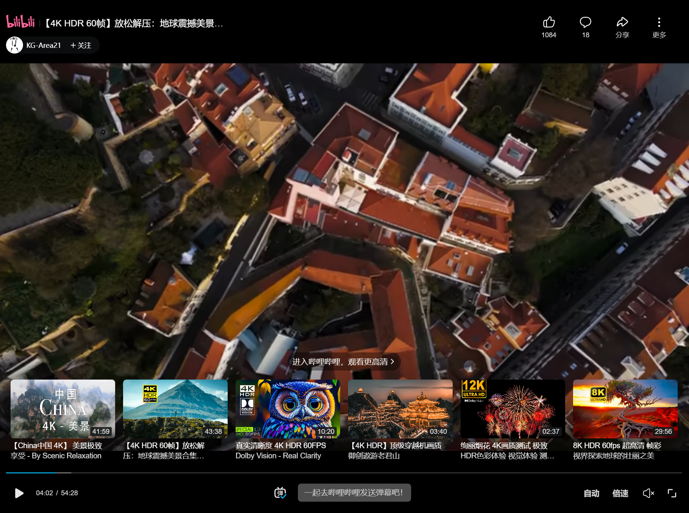

# hexo-tag-azplayer

## 安装
进入 hexo 主目录，然后执行
```
npm i -save  "https://github.com/pxysea/hexo-tag-azplayer.git"
```
## 配置

## 使用示例
B站视频示例
```javascript

```
Youtube 示例
```javascript

```


[查看演示](https://az-web.site/2024/03/01/%E6%B5%8B%E8%AF%95/)

## 功能列表

1. 支持 Markdown B站链接
2. 增加 Youtube 支持

## 感谢

修改自 [hexo-bilibili-plus](https://github.com/pk5ls20/hexo-bilibili-plus)
[如何在网站中嵌入B 站视频引用](https://cloud.tencent.com/developer/article/1858356)